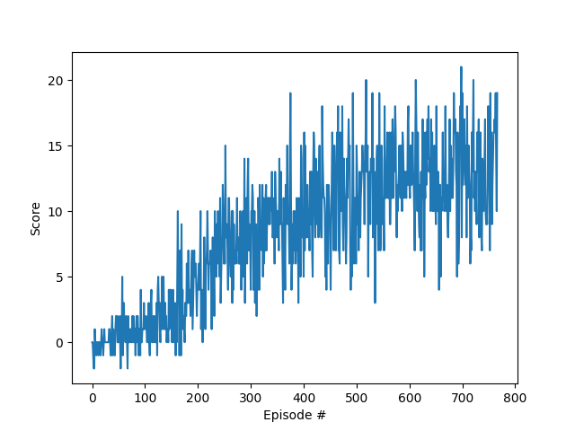

# Report for Navigation
## Learning Algorithms
I've implemented the following algorithms:
- Double DQN ([paper](https://arxiv.org/abs/1509.06461))
- Dueling Network ([paper](https://arxiv.org/abs/1511.06581))
- Distributional Reinforcement Learning ([paper](http://proceedings.mlr.press/v70/bellemare17a.html))

In addition, I've added the spectral normalization to the last two layer of the network according to [this paper](https://arxiv.org/pdf/2105.05246.pdf).

## Model
I've used a Multi-Layer-Perceptron with three layers and  512 hidden units. As described above, I've applied the spectral normalization to the last two layer.

## Results
The learning algorithm to which is applied Dueling Network, Distributional RL and spectral normalization attained +13 average reward over 100 episodes in total 667 episodes.

## Future Work
- Try the other algorithms in Rainbow such as prioritized experience replay
- Explore the other network architecture.