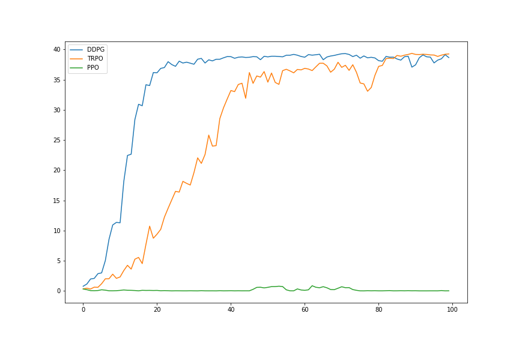

# Report for Reacher
## Learning Algorithms
I've implemented the following actor-critic algorithms:
- DDPG ([paper](https://arxiv.org/abs/1509.02971)),
- TRPO ([paper](https://arxiv.org/abs/1502.05477)),
- PPO ([paper](https://arxiv.org/abs/1707.06347)),

and compare their performances.

For training the critic, TD(0) is optimized in all three algorithms. 

As optimizer, [Adam optimizer](https://arxiv.org/abs/1412.6980) is used in all algorithms.

## Model
- Critic Model
  
Multi-Layer-Perceptron with four layers, [layer normalization](https://arxiv.org/abs/1607.06450) for the all hidden layers and 256 hidden units. The spectral normalization to the last two layer is applied.

- Actor Model

Multi-Layer Perceptron with three layers, layer normalization, and 256 hidden units. 

## Hyper-Parameters
I used the following hyper-parameters.
- Batchsize: 256
- Number of hidden units: 256
- Learning rate for Actor model: 1e-03 
- Learning rate for Critic model: 1e-03 
- Gamma: 0.99
- Buffer size: 1e6
- Tau for soft update: 1e-2
- Noise Variance: 1.0
- Update Every: 30
- Number of Updates: 10

## Results
DDPG and TRPO succeeded to attain the required rewards in 100 episodes, but PPO didn't achieve the required success. The following graph is the transition of the attained reward of each algorithms.

## Future Work
- Introduce rollouts and set loss as TD_lambda and generalized advantages estimator